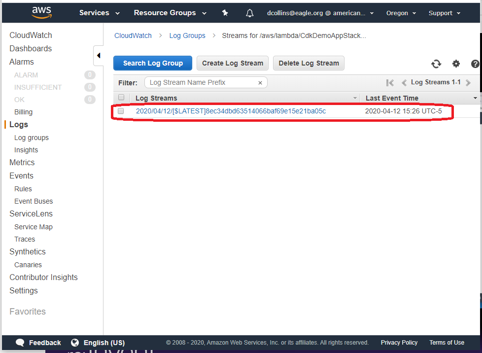
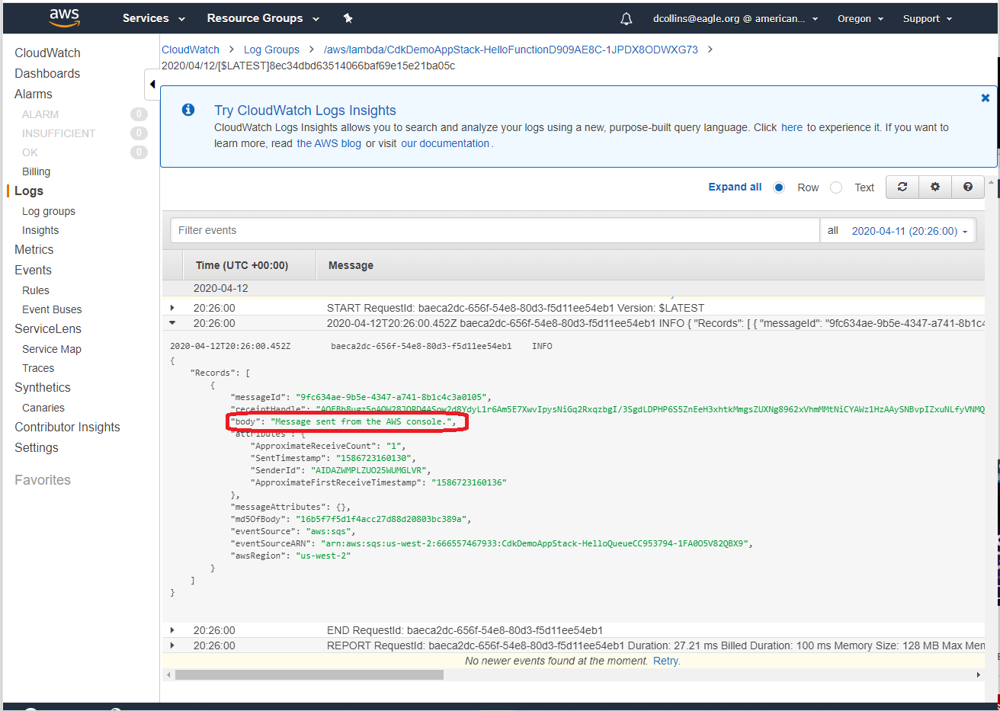

# HowTo: Demo
Using the AWS CDK and AWS CloudFormation.
1. Install [Visual Studio Code](https://code.visualstudio.com/).
2. Install [Git](https://git-scm.com/download/win).
3. Install the [AWS CLI](https://docs.aws.amazon.com/cli/latest/userguide/install-cliv2-windows.html#cliv2-windows-install).
4. Install [Node](https://nodejs.org/en/download/).  Let it install Chocolately and other necessary tools.
5. Install the [AWS CDK](https://docs.aws.amazon.com/cdk/latest/guide/getting_started.html).
6. Install the "AWS Toolkit" Visual Studio Code extension.

In a windows cmd.exe go to your Code directory, make a new directory `cdk-demo-app` and init a new CDK project.

```
cd %OneDrive%
cd Documents
cd Code
mkdir cdk-demo-app
cd cdk-demo-app
cdk init -l typescript # uses typescipt - there are other options
```

In a different cmd.exe window run `npm run watch`.

Back to your original cmd.exe.

The `cdk init` creates a default entry point in the "bin" folder.  It will name it based on the folder name from where you ran `cdk init` (`cdk-demo-app.ts` in my case).
This cdk-demo-app.ts is your "entry point" so to speak.

In cmd.exe run the command `cdk synth`.  Based on the template gernerated by `cdk init` - this command will display a CloudFormation template from our application.  In our case we see the following, which looks like a lot but is actually just a set of definitions.

```
Resources:
  CDKMetadata:
    Type: AWS::CDK::Metadata
    Properties:
      Modules: aws-cdk=1.32.2,@aws-cdk/core=1.32.2,@aws-cdk/cx-api=1.32.2,jsii-runtime=node.js/v12.16.2
    Condition: CDKMetadataAvailable
Conditions:
  CDKMetadataAvailable:
    Fn::Or:
      - Fn::Or:
          - Fn::Equals:
              - Ref: AWS::Region
              - ap-east-1
          - Fn::Equals:
              - Ref: AWS::Region
              - ap-northeast-1
          - Fn::Equals:
              - Ref: AWS::Region
              - ap-northeast-2
          - Fn::Equals:
              - Ref: AWS::Region
              - ap-south-1
          - Fn::Equals:
              - Ref: AWS::Region
              - ap-southeast-1
          - Fn::Equals:
              - Ref: AWS::Region
              - ap-southeast-2
          - Fn::Equals:
              - Ref: AWS::Region
              - ca-central-1
          - Fn::Equals:
              - Ref: AWS::Region
              - cn-north-1
          - Fn::Equals:
              - Ref: AWS::Region
              - cn-northwest-1
          - Fn::Equals:
              - Ref: AWS::Region
              - eu-central-1
      - Fn::Or:
          - Fn::Equals:
              - Ref: AWS::Region
              - eu-north-1
          - Fn::Equals:
              - Ref: AWS::Region
              - eu-west-1
          - Fn::Equals:
              - Ref: AWS::Region
              - eu-west-2
          - Fn::Equals:
              - Ref: AWS::Region
              - eu-west-3
          - Fn::Equals:
              - Ref: AWS::Region
              - me-south-1
          - Fn::Equals:
              - Ref: AWS::Region
              - sa-east-1
          - Fn::Equals:
              - Ref: AWS::Region
              - us-east-1
          - Fn::Equals:
              - Ref: AWS::Region
              - us-east-2
          - Fn::Equals:
              - Ref: AWS::Region
              - us-west-1
          - Fn::Equals:
              - Ref: AWS::Region
              - us-west-2
```

## Build an SMS Queue
Take a mninute to look over the [AWS Construct Library](https://docs.aws.amazon.com/cdk/api/latest/docs/aws-construct-library.html).  
Take note of [AWS SQS](https://docs.aws.amazon.com/cdk/api/latest/docs/aws-sqs-readme.html).

Go back to cmd.exe and install the SQS Library: `npm install @aws-cdk/aws-sqs`.

Now that we have the SQS library installed we can go back to our Visual Studio Code editor and import it into "bin/cdk-demo-app.ts".

FYI, the AWS CDK uses what it calls "smart defaults" with the idea that you should be specifying few (if any) parameters.

If you run `cdk synth` again you will see the creation of the SMS Queue.

```
Resources:
  HelloQueueCC953794:
    Type: AWS::SQS::Queue
    Metadata:
      aws:cdk:path: CdkDemoAppStack/HelloQueue/Resource
  CDKMetadata:
    Type: AWS::CDK::Metadata
    Properties:
      Modules: aws-cdk=1.32.2,@aws-cdk/aws-cloudwatch=1.32.2,@aws-cdk/aws-iam=1.32.2,@aws-cdk/aws-kms=1.32.2,@aws-cdk/aws-sqs=1.32.2,@aws-cdk/core=1.32.2,@aws-cdk/cx-api=1.32.2,@aws-cdk/region-info=1.32.2,jsii-runtime=node.js/v12.16.2
    Condition: CDKMetadataAvailable
Conditions:
  CDKMetadataAvailable: <SNIP>
  ```

## Setup AWS Environment Variables
In cmd.exe you will need to run the following with your access credentials.  If you do not know what your Access Key ID and Secret Access Key are, please contact your AWS administrator (Dan Collins at the time of this document's creation).
_No, these are not real credentials._

```
setx AWS_ACCESS_KEY_ID AKIAZWMPLrOX3EQIVM5
set AWS_ACCESS_KEY_ID=AKIAZWMPLrOX3EQIVM5
setx AWS_SECRET_ACCESS_KEY 7Bx9dNHmoeBZfcvwg1RIpsa2JzVQ2HthrtWE8mz
set AWS_SECRET_ACCESS_KEY=7Bx9dNHmoeBZfcvwg1RIpsa2JzVQ2HthrtWE8mz
setx AWS_DEFAULT_REGION us-west-2
set AWS_DEFAULT_REGION=us-west-2
```

## CDK Deploy
In cmd.exe run `cdk deploy`.


And if you check your AWS console you should see the new Queue. 

_Region: please be sure to select the correct Region.  If in your cdk-demo-app-stack.js you specified a particular Region, you should look there.  I did not select a particular region so it will use what my "AWS_DEFAULT_REGION" environment variable was set to (`us-west-2`).


You can also check queue deployment by running `aws sqs list-queues` on your cmd.exe window.


---

## Bring in the Lambda Library

In cmd.exe `npm i @aws-cdk/aws-lambda @aws-cdk/aws-lambda-event-sources`.

Now you need to require them and use them in your Code editor.

You will need to create a `lambda` directory and put an `index.ts` file there with these contents:

```
exports.handler = async function (event: any) {
    console.log(JSON.stringify(event, undefined, 2));
}
```

Your lib/cdk-demo-app-stack.js file will look like this:

```
"use strict";
const sqs = require('@aws-cdk/aws-sqs');
const lambda = require('@aws-cdk/aws-lambda');
const event_sources = require('@aws-cdk/aws-lambda-event-sources');

Object.defineProperty(exports, "__esModule", { value: true });
const cdk = require("@aws-cdk/core");
class CdkDemoAppStack extends cdk.Stack {
    constructor(scope, id, props) {
        super(scope, id, props);
        // The code that defines your stack goes here

        const queue = new sqs.Queue(this, 'HelloQueue');

        const fn = new lambda.Function(this, 'HelloFunction', {
        runtime: lambda.Runtime.NODEJS_10_X,
        code: lambda.Code.asset('lambda'),
        handler: 'index.handler'
        });

        fn.addEventSource(new event_sources.SqsEventSource(queue));
    }
}
exports.CdkDemoAppStack = CdkDemoAppStack;
```

## cdk diff

From cmd.exe run `cdk diff` to see what changes will manifest on your deployed stack when you deploy the version of code on your desktop:


```
Stack CdkDemoAppStack
IAM Statement Changes
┌───┬──────────────────────────┬────────┬──────────────────────────┬──────────────────────────┬───────────┐
│   │ Resource                 │ Effect │ Action                   │ Principal                │ Condition │
├───┼──────────────────────────┼────────┼──────────────────────────┼──────────────────────────┼───────────┤
│ + │ ${HelloFunction/ServiceR │ Allow  │ sts:AssumeRole           │ Service:lambda.amazonaws │           │
│   │ ole.Arn}                 │        │                          │ .com                     │           │
├───┼──────────────────────────┼────────┼──────────────────────────┼──────────────────────────┼───────────┤
│ + │ ${HelloQueue.Arn}        │ Allow  │ sqs:ChangeMessageVisibil │ AWS:${HelloFunction/Serv │           │
│   │                          │        │ ity                      │ iceRole}                 │           │
│   │                          │        │ sqs:DeleteMessage        │                          │           │
│   │                          │        │ sqs:GetQueueAttributes   │                          │           │
│   │                          │        │ sqs:GetQueueUrl          │                          │           │
│   │                          │        │ sqs:ReceiveMessage       │                          │           │
└───┴──────────────────────────┴────────┴──────────────────────────┴──────────────────────────┴───────────┘
IAM Policy Changes
┌───┬──────────────────────────────┬──────────────────────────────────────────────────────────────────────┐
│   │ Resource                     │ Managed Policy ARN                                                   │
├───┼──────────────────────────────┼──────────────────────────────────────────────────────────────────────┤
│ + │ ${HelloFunction/ServiceRole} │ arn:${AWS::Partition}:iam::aws:policy/service-role/AWSLambdaBasicExe │
│   │                              │ cutionRole                                                           │
└───┴──────────────────────────────┴──────────────────────────────────────────────────────────────────────┘
(NOTE: There may be security-related changes not in this list. See https://github.com/aws/aws-cdk/issues/1299)

Parameters
[+] Parameter AssetParameters/d1d11c36bc5d4a1a197ca8409a3ac34618b43b74d2b9151b0b9b000192e4993a/S3Bucket AssetParametersd1d11c36bc5d4a1a197ca8409a3ac34618b43b74d2b9151b0b9b000192e4993aS3Bucket22FA9728: {"Type":"String","Description":"S3 bucket for asset \"d1d11c36bc5d4a1a197ca8409a3ac34618b43b74d2b9151b0b9b000192e4993a\""}
[+] Parameter AssetParameters/d1d11c36bc5d4a1a197ca8409a3ac34618b43b74d2b9151b0b9b000192e4993a/S3VersionKey AssetParametersd1d11c36bc5d4a1a197ca8409a3ac34618b43b74d2b9151b0b9b000192e4993aS3VersionKey526C0619: {"Type":"String","Description":"S3 key for asset version \"d1d11c36bc5d4a1a197ca8409a3ac34618b43b74d2b9151b0b9b000192e4993a\""}
[+] Parameter AssetParameters/d1d11c36bc5d4a1a197ca8409a3ac34618b43b74d2b9151b0b9b000192e4993a/ArtifactHash AssetParametersd1d11c36bc5d4a1a197ca8409a3ac34618b43b74d2b9151b0b9b000192e4993aArtifactHash7169DCD4: {"Type":"String","Description":"Artifact hash for asset \"d1d11c36bc5d4a1a197ca8409a3ac34618b43b74d2b9151b0b9b000192e4993a\""}

Resources
[+] AWS::IAM::Role HelloFunction/ServiceRole HelloFunctionServiceRole186F1BA8
[+] AWS::IAM::Policy HelloFunction/ServiceRole/DefaultPolicy HelloFunctionServiceRoleDefaultPolicyC48BCC4C
[+] AWS::Lambda::Function HelloFunction HelloFunctionD909AE8C
[+] AWS::Lambda::EventSourceMapping HelloFunction/SqsEventSource:CdkDemoAppStackHelloQueueEC8F37F2 HelloFunctionSqsEventSourceCdkDemoAppStackHelloQueueEC8F37F22EF0131A
```

## Pre-deply AWS screenshots

_Be sure to select thje correct Region at the top of the console._

### SMS


### Lambda


### Roles

#

### Policies


---

## Deploy SMS Queue and Lambda function

from cmd.exe run `cdk deploy`.

## Post-deply AWS screenshots

### SMS


### Lambda


### Lambda Function Mapping


### Roles


### Policies


---

## New `cdk synth -JSON`

```
{
  "Resources": {
    "HelloQueueCC953794": {
      "Type": "AWS::SQS::Queue",
      "Metadata": {
        "aws:cdk:path": "CdkDemoAppStack/HelloQueue/Resource"
      }
    },
    "HelloFunctionServiceRole186F1BA8": {
      "Type": "AWS::IAM::Role",
      "Properties": {
        "AssumeRolePolicyDocument": {
          "Statement": [
            {
              "Action": "sts:AssumeRole",
              "Effect": "Allow",
              "Principal": {
                "Service": "lambda.amazonaws.com"
              }
            }
          ],
          "Version": "2012-10-17"
        },
        "ManagedPolicyArns": [
          {
            "Fn::Join": [
              "",
              [
                "arn:",
                {
                  "Ref": "AWS::Partition"
                },
                ":iam::aws:policy/service-role/AWSLambdaBasicExecutionRole"
              ]
            ]
          }
        ]
      },
      "Metadata": {
        "aws:cdk:path": "CdkDemoAppStack/HelloFunction/ServiceRole/Resource"
      }
    },
    "HelloFunctionServiceRoleDefaultPolicyC48BCC4C": {
      "Type": "AWS::IAM::Policy",
      "Properties": {
        "PolicyDocument": {
          "Statement": [
            {
              "Action": [
                "sqs:ReceiveMessage",
                "sqs:ChangeMessageVisibility",
                "sqs:GetQueueUrl",
                "sqs:DeleteMessage",
                "sqs:GetQueueAttributes"
              ],
              "Effect": "Allow",
              "Resource": {
                "Fn::GetAtt": [
                  "HelloQueueCC953794",
                  "Arn"
                ]
              }
            }
          ],
          "Version": "2012-10-17"
        },
        "PolicyName": "HelloFunctionServiceRoleDefaultPolicyC48BCC4C",
        "Roles": [
          {
            "Ref": "HelloFunctionServiceRole186F1BA8"
          }
        ]
      },
      "Metadata": {
        "aws:cdk:path": "CdkDemoAppStack/HelloFunction/ServiceRole/DefaultPolicy/Resource"
      }
    },
    "HelloFunctionD909AE8C": {
      "Type": "AWS::Lambda::Function",
      "Properties": {
        "Code": {
          "S3Bucket": {
            "Ref": "AssetParametersd1d11c36bc5d4a1a197ca8409a3ac34618b43b74d2b9151b0b9b000192e4993aS3Bucket22FA9728"
          },
          "S3Key": {
            "Fn::Join": [
              "",
              [
                {
                  "Fn::Select": [
                    0,
                    {
                      "Fn::Split": [
                        "||",
                        {
                          "Ref": "AssetParametersd1d11c36bc5d4a1a197ca8409a3ac34618b43b74d2b9151b0b9b000192e4993aS3VersionKey526C0619"
                        }
                      ]
                    }
                  ]
                },
                {
                  "Fn::Select": [
                    1,
                    {
                      "Fn::Split": [
                        "||",
                        {
                          "Ref": "AssetParametersd1d11c36bc5d4a1a197ca8409a3ac34618b43b74d2b9151b0b9b000192e4993aS3VersionKey526C0619"
                        }
                      ]
                    }
                  ]
                }
              ]
            ]
          }
        },
        "Handler": "index.handler",
        "Role": {
          "Fn::GetAtt": [
            "HelloFunctionServiceRole186F1BA8",
            "Arn"
          ]
        },
        "Runtime": "nodejs10.x"
      },
      "DependsOn": [
        "HelloFunctionServiceRoleDefaultPolicyC48BCC4C",
        "HelloFunctionServiceRole186F1BA8"
      ],
      "Metadata": {
        "aws:cdk:path": "CdkDemoAppStack/HelloFunction/Resource",
        "aws:asset:path": "asset.d1d11c36bc5d4a1a197ca8409a3ac34618b43b74d2b9151b0b9b000192e4993a",
        "aws:asset:property": "Code"
      }
    },
    "HelloFunctionSqsEventSourceCdkDemoAppStackHelloQueueEC8F37F22EF0131A": {
      "Type": "AWS::Lambda::EventSourceMapping",
      "Properties": {
        "EventSourceArn": {
          "Fn::GetAtt": [
            "HelloQueueCC953794",
            "Arn"
          ]
        },
        "FunctionName": {
          "Ref": "HelloFunctionD909AE8C"
        }
      },
      "Metadata": {
        "aws:cdk:path": "CdkDemoAppStack/HelloFunction/SqsEventSource:CdkDemoAppStackHelloQueueEC8F37F2/Resource"
      }
    },
    "CDKMetadata": {
      "Type": "AWS::CDK::Metadata",
      "Properties": {
        "Modules": "aws-cdk=1.32.2,@aws-cdk/assets=1.32.2,@aws-cdk/aws-apigateway=1.32.2,@aws-cdk/aws-cloudwatch=1.32.2,@aws-cdk/aws-ec2=1.32.2,@aws-cdk/aws-events=1.32.2,@aws-cdk/aws-iam=1.32.2,@aws-cdk/aws-kms=1.32.2,@aws-cdk/aws-lambda=1.32.2,@aws-cdk/aws-lambda-event-sources=1.32.2,@aws-cdk/aws-logs=1.32.2,@aws-cdk/aws-s3=1.32.2,@aws-cdk/aws-s3-assets=1.32.2,@aws-cdk/aws-s3-notifications=1.32.2,@aws-cdk/aws-sns=1.32.2,@aws-cdk/aws-sns-subscriptions=1.32.2,@aws-cdk/aws-sqs=1.32.2,@aws-cdk/aws-ssm=1.32.2,@aws-cdk/core=1.32.2,@aws-cdk/cx-api=1.32.2,@aws-cdk/region-info=1.32.2,jsii-runtime=node.js/v12.16.2"
      },
      "Condition": "CDKMetadataAvailable"
    }
  },
  "Parameters": {
    "AssetParametersd1d11c36bc5d4a1a197ca8409a3ac34618b43b74d2b9151b0b9b000192e4993aS3Bucket22FA9728": {
      "Type": "String",
      "Description": "S3 bucket for asset \"d1d11c36bc5d4a1a197ca8409a3ac34618b43b74d2b9151b0b9b000192e4993a\""
    },
    "AssetParametersd1d11c36bc5d4a1a197ca8409a3ac34618b43b74d2b9151b0b9b000192e4993aS3VersionKey526C0619": {
      "Type": "String",
      "Description": "S3 key for asset version \"d1d11c36bc5d4a1a197ca8409a3ac34618b43b74d2b9151b0b9b000192e4993a\""
    },
    "AssetParametersd1d11c36bc5d4a1a197ca8409a3ac34618b43b74d2b9151b0b9b000192e4993aArtifactHash7169DCD4": {
      "Type": "String",
      "Description": "Artifact hash for asset \"d1d11c36bc5d4a1a197ca8409a3ac34618b43b74d2b9151b0b9b000192e4993a\""
    }
  },
  "Conditions": {
    "CDKMetadataAvailable": {
      "Fn::Or": [
        {
          "Fn::Or": [
            {
              "Fn::Equals": [
                {
                  "Ref": "AWS::Region"
                },
                "ap-east-1"
              ]
            },
            {
              "Fn::Equals": [
                {
                  "Ref": "AWS::Region"
                },
                "ap-northeast-1"
              ]
            },
            {
              "Fn::Equals": [
                {
                  "Ref": "AWS::Region"
                },
                "ap-northeast-2"
              ]
            },
            {
              "Fn::Equals": [
                {
                  "Ref": "AWS::Region"
                },
                "ap-south-1"
              ]
            },
            {
              "Fn::Equals": [
                {
                  "Ref": "AWS::Region"
                },
                "ap-southeast-1"
              ]
            },
            {
              "Fn::Equals": [
                {
                  "Ref": "AWS::Region"
                },
                "ap-southeast-2"
              ]
            },
            {
              "Fn::Equals": [
                {
                  "Ref": "AWS::Region"
                },
                "ca-central-1"
              ]
            },
            {
              "Fn::Equals": [
                {
                  "Ref": "AWS::Region"
                },
                "cn-north-1"
              ]
            },
            {
              "Fn::Equals": [
                {
                  "Ref": "AWS::Region"
                },
                "cn-northwest-1"
              ]
            },
            {
              "Fn::Equals": [
                {
                  "Ref": "AWS::Region"
                },
                "eu-central-1"
              ]
            }
          ]
        },
        {
          "Fn::Or": [
            {
              "Fn::Equals": [
                {
                  "Ref": "AWS::Region"
                },
                "eu-north-1"
              ]
            },
            {
              "Fn::Equals": [
                {
                  "Ref": "AWS::Region"
                },
                "eu-west-1"
              ]
            },
            {
              "Fn::Equals": [
                {
                  "Ref": "AWS::Region"
                },
                "eu-west-2"
              ]
            },
            {
              "Fn::Equals": [
                {
                  "Ref": "AWS::Region"
                },
                "eu-west-3"
              ]
            },
            {
              "Fn::Equals": [
                {
                  "Ref": "AWS::Region"
                },
                "me-south-1"
              ]
            },
            {
              "Fn::Equals": [
                {
                  "Ref": "AWS::Region"
                },
                "sa-east-1"
              ]
            },
            {
              "Fn::Equals": [
                {
                  "Ref": "AWS::Region"
                },
                "us-east-1"
              ]
            },
            {
              "Fn::Equals": [
                {
                  "Ref": "AWS::Region"
                },
                "us-east-2"
              ]
            },
            {
              "Fn::Equals": [
                {
                  "Ref": "AWS::Region"
                },
                "us-west-1"
              ]
            },
            {
              "Fn::Equals": [
                {
                  "Ref": "AWS::Region"
                },
                "us-west-2"
              ]
            }
          ]
        }
      ]
    }
  }
}
```

Notice that the AWS CDK creates an IAM Role and Policy that connects the Lambda function with the SMS Queue.

```
    "HelloFunctionServiceRole186F1BA8": {
      "Type": "AWS::IAM::Role",
      "Properties": {
        "AssumeRolePolicyDocument": {
          "Statement": [
            {
              "Action": "sts:AssumeRole",
              "Effect": "Allow",
              "Principal": {
                "Service": "lambda.amazonaws.com"
              }
            }
          ],
          "Version": "2012-10-17"
        },
        "ManagedPolicyArns": [
          {
            "Fn::Join": [
              "",
              [
                "arn:",
                {
                  "Ref": "AWS::Partition"
                },
                ":iam::aws:policy/service-role/AWSLambdaBasicExecutionRole"
              ]
            ]
          }
        ]
      },
      "Metadata": {
        "aws:cdk:path": "CdkDemoAppStack/HelloFunction/ServiceRole/Resource"
      }
    },
    "HelloFunctionServiceRoleDefaultPolicyC48BCC4C": {
      "Type": "AWS::IAM::Policy",
      "Properties": {
        "PolicyDocument": {
          "Statement": [
            {
              "Action": [
                "sqs:ReceiveMessage",
                "sqs:ChangeMessageVisibility",
                "sqs:GetQueueUrl",
                "sqs:DeleteMessage",
                "sqs:GetQueueAttributes"
              ],
              "Effect": "Allow",
              "Resource": {
                "Fn::GetAtt": [
                  "HelloQueueCC953794",
                  "Arn"
                ]
              }
            }
          ],
          "Version": "2012-10-17"
        },
        "PolicyName": "HelloFunctionServiceRoleDefaultPolicyC48BCC4C",
        "Roles": [
          {
            "Ref": "HelloFunctionServiceRole186F1BA8"
          }
        ]
      },
      "Metadata": {
        "aws:cdk:path": "CdkDemoAppStack/HelloFunction/ServiceRole/DefaultPolicy/Resource"
      }
    },
```

---

### Sending a message manually in AWS SMS

Go to your AWS SQS instance and click on it to view details.


Click the "Queue Actions" button and select "Send a Message" from the dropdown.


Type an appropriate and memorable message and click the "Send Message" button.


Take note of the sent message attributes and click "Close".


To see your message, go back to viewing the details of the Lambda function and click the "Monitoring" tab.


Click the "View logs in CloudWatch" button.


Click the one with the relevant timestamp.



you should see your message.



---
32:00 in https://www.youtube.com/watch?v=Lh-kVC2r2AU

